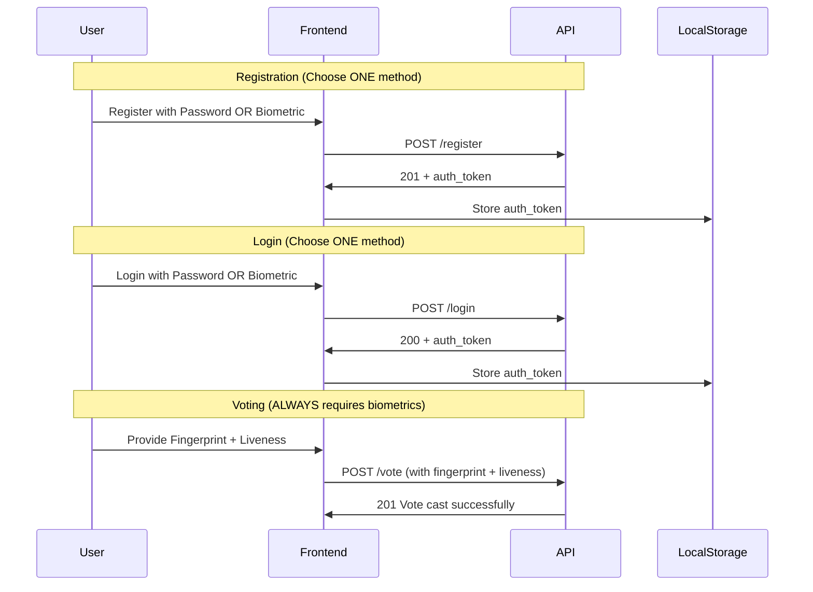

# CovertVote API Documentation - Frontend Developer Guide

## 📚 Quick Links

- **Swagger UI (Interactive)**: http://localhost:8080/swagger/index.html
- **Base URL**: `http://localhost:8080/api/v1`
- **Health Check**: http://localhost:8080/health
- **Version**: 1.0.0

---

## 🚀 Quick Start

### Option 1: Use Swagger UI (Recommended)
Open http://localhost:8080/swagger/index.html in your browser to:
- ✅ Browse all endpoints interactively
- ✅ Test API calls with "Try it out" button
- ✅ View request/response schemas
- ✅ Copy cURL commands

### Option 2: Use This Documentation
Continue reading for detailed frontend integration guides.

---

## 👥 Development Mode: Eligible Voters

**For Development/Testing**, the system is pre-configured with **105 eligible voter IDs**:

### Available Test Voter IDs:
- `voter001` to `voter100` - 100 test voters
- `test_voter` - Generic test account
- `admin` - Admin test account
- `alice`, `bob`, `charlie` - Named test accounts

**Important**: Only these voter IDs can register. Using any other ID will result in "voter not eligible" error.

### Quick Test:
```bash
# Register voter001 with password
curl -X POST http://localhost:8080/api/v1/register \
  -H "Content-Type: application/json" \
  -d '{
    "voter_id": "voter001",
    "password": "SecurePass123!"
  }'
```

---

## 📋 Table of Contents

1. [Authentication](#authentication)
2. [Complete Voting Flow](#complete-voting-flow)
3. [Public Endpoints](#public-endpoints)
4. [Authenticated Endpoints](#authenticated-endpoints)
5. [Admin Endpoints](#admin-endpoints)
6. [Frontend Integration](#frontend-integration)
7. [Error Handling](#error-handling)
8. [Rate Limiting](#rate-limiting)
9. [Security Best Practices](#security-best-practices)

---

## 🔐 Authentication

### Overview
The API supports **dual authentication methods** for registration and login:
- **Option 1**: Biometric (Fingerprint)
- **Option 2**: Password

**CRITICAL**: Voting ALWAYS requires fingerprint + liveness verification, regardless of registration method.

### Authentication Flow



---

## 🗳️ Complete Voting Flow

### Step-by-Step Integration

#### **Step 1: Register Voter**

**Endpoint:** `POST /api/v1/register`

**Option A: Register with Password**

```javascript
const registrationData = {
  voter_id: "voter001",  // Use eligible voter ID (voter001-voter100)
  password: "SecurePassword123!"
};

const response = await fetch('http://localhost:8080/api/v1/register', {
  method: 'POST',
  headers: { 'Content-Type': 'application/json' },
  body: JSON.stringify(registrationData)
});

const result = await response.json();
```

**Option B: Register with Biometric**

```javascript
const registrationData = {
  voter_id: "voter123",
  fingerprint_data: fingerprintBytes,  // Uint8Array or base64
  liveness_data: livenessBytes         // Uint8Array or base64
};

const response = await fetch('http://localhost:8080/api/v1/register', {
  method: 'POST',
  headers: { 'Content-Type': 'application/json' },
  body: JSON.stringify(registrationData)
});

const result = await response.json();
```

**Success Response (201):**
```json
{
  "voter_id": "voter123",
  "public_key": "0x1234abcd...",
  "smdc_public_credential": "0xabcd1234...",
  "merkle_root": "0x5678efgh...",
  "registration_time": 1768165200,
  "message": "Registration successful. Session token provided in Set-Cookie header."
}
```

**Store credentials:**
```javascript
// Token is in Set-Cookie header and also in response
const authToken = result.auth_token || getCookie('session_token');
localStorage.setItem('auth_token', authToken);
localStorage.setItem('voter_id', result.voter_id);
```

---

#### **Step 2: Login**

**Endpoint:** `POST /api/v1/login`

**Option A: Login with Password**

```javascript
const loginData = {
  voter_id: "voter001",  // Use registered eligible voter ID
  password: "SecurePassword123!"
};

const response = await fetch('http://localhost:8080/api/v1/login', {
  method: 'POST',
  headers: { 'Content-Type': 'application/json' },
  body: JSON.stringify(loginData)
});

const result = await response.json();
```

**Option B: Login with Fingerprint**

```javascript
const loginData = {
  voter_id: "voter123",
  fingerprint_data: fingerprintBytes  // Uint8Array or base64
};

const response = await fetch('http://localhost:8080/api/v1/login', {
  method: 'POST',
  headers: { 'Content-Type': 'application/json' },
  body: JSON.stringify(loginData)
});

const result = await response.json();
```

**Success Response (200):**
```json
{
  "voter_id": "voter123",
  "auth_token": "eyJhbGciOiJIUzI1NiIs...",
  "expires_in": 86400,
  "message": "Login successful"
}
```

**Store token:**
```javascript
localStorage.setItem('auth_token', result.auth_token);
localStorage.setItem('voter_id', result.voter_id);
```

---

#### **Step 3: Get Available Elections**

**Endpoint:** `GET /api/v1/elections`

```javascript
const response = await fetch('http://localhost:8080/api/v1/elections');
const data = await response.json();
```

**Response:**
```json
{
  "elections": [
    {
      "election_id": "election001",
      "title": "Presidential Election 2026",
      "description": "Annual presidential election",
      "candidates": [
        {
          "id": 1,
          "name": "Candidate A",
          "description": "Experienced leader",
          "party": "Party 1"
        },
        {
          "id": 2,
          "name": "Candidate B",
          "description": "Reform candidate",
          "party": "Party 2"
        }
      ],
      "start_time": 1768165153,
      "end_time": 1768251553,
      "is_active": true,
      "total_votes": 0
    }
  ],
  "total": 1
}
```

---

#### **Step 4: Cast Vote** ⚠️ **REQUIRES BIOMETRICS**

**Endpoint:** `POST /api/v1/vote`

**⚡ CRITICAL:** Every vote MUST include fingerprint + liveness data, regardless of how you registered or logged in.

```javascript
const voteData = {
  voter_id: localStorage.getItem('voter_id'),
  election_id: "election001",
  candidate_id: 1,
  smdc_slot_index: 0,  // Use appropriate SMDC slot
  auth_token: localStorage.getItem('auth_token'),
  // REQUIRED FOR EVERY VOTE:
  fingerprint_data: fingerprintBytes,  // Fresh fingerprint capture
  liveness_data: livenessBytes         // Fresh liveness check
};

const response = await fetch('http://localhost:8080/api/v1/vote', {
  method: 'POST',
  headers: {
    'Authorization': `Bearer ${localStorage.getItem('auth_token')}`,
    'Content-Type': 'application/json'
  },
  body: JSON.stringify(voteData)
});

const result = await response.json();
```

**Success Response (201):**
```json
{
  "receipt_id": "receipt_xyz789",
  "voter_id": "voter123",
  "election_id": "election001",
  "timestamp": 1768165200,
  "blockchain_tx_id": "tx_0x5678...",
  "key_image": "0xabcd1234...",
  "message": "Vote cast successfully. Keep your receipt ID for verification."
}
```

**⚠️ Important Notes:**
- Biometric data must be captured fresh for each vote (anti-coercion measure)
- Liveness detection prevents spoofing attacks
- Even password-registered users must provide biometrics to vote
- Save the `receipt_id` for vote verification

```javascript
localStorage.setItem('vote_receipt', result.receipt_id);
alert(`Vote recorded! Your receipt: ${result.receipt_id}`);
```

---

#### **Step 5: Verify Vote (Optional)**

**Endpoint:** `POST /api/v1/verify-vote`

```javascript
const verifyData = {
  receipt_id: localStorage.getItem('vote_receipt'),
  voter_id: localStorage.getItem('voter_id')
};

const response = await fetch('http://localhost:8080/api/v1/verify-vote', {
  method: 'POST',
  headers: {
    'Authorization': `Bearer ${localStorage.getItem('auth_token')}`,
    'Content-Type': 'application/json'
  },
  body: JSON.stringify(verifyData)
});

const result = await response.json();
```

**Response:**
```json
{
  "valid": true,
  "election_id": "election001",
  "timestamp": 1768165200,
  "blockchain_tx_id": "tx_0x5678...",
  "message": "Vote verified successfully"
}
```

---

#### **Step 6: Check Results**

**Endpoint:** `GET /api/v1/results/:electionId`

```javascript
const electionId = "election001";
const response = await fetch(`http://localhost:8080/api/v1/results/${electionId}`);
const results = await response.json();
```

**Response:**
```json
{
  "election_id": "election001",
  "candidate_tallies": {
    "1": 750,
    "2": 500
  },
  "total_votes": 1250,
  "tally_time": 1768251600,
  "verified": true
}
```

---

## 📡 Public Endpoints (No Authentication)

### 1. Health Check

**GET** `/health`

```javascript
const response = await fetch('http://localhost:8080/health');
const health = await response.json();
// { "status": "healthy", "version": "1.0.0", "uptime": 3600 }
```

---

### 2. Readiness Check

**GET** `/ready`

```javascript
const response = await fetch('http://localhost:8080/ready');
const status = await response.json();
```

---

### 3. Liveness Check

**GET** `/live`

```javascript
const response = await fetch('http://localhost:8080/live');
// { "status": "alive" }
```

---

### 4. Get Elections List

**GET** `/api/v1/elections`

```javascript
const response = await fetch('http://localhost:8080/api/v1/elections');
const data = await response.json();
```

---

### 5. Get Election Details

**GET** `/api/v1/elections/:id`

```javascript
const electionId = "election001";
const response = await fetch(`http://localhost:8080/api/v1/elections/${electionId}`);
const election = await response.json();
```

---

### 6. Get Vote Count

**GET** `/api/v1/vote-count`

```javascript
const response = await fetch('http://localhost:8080/api/v1/vote-count');
const count = await response.json();
// { "total_votes": 1250, "timestamp": 1768165200 }
```

---

### 7. Verify Eligibility

**POST** `/api/v1/verify-eligibility`

```javascript
const response = await fetch('http://localhost:8080/api/v1/verify-eligibility', {
  method: 'POST',
  headers: { 'Content-Type': 'application/json' },
  body: JSON.stringify({
    voter_id: "voter123"
  })
});

const result = await response.json();
```

---

## 🔒 Authenticated Endpoints

### Get Voter Info

**GET** `/api/v1/voter/:id`

```javascript
const voterId = localStorage.getItem('voter_id');
const response = await fetch(`http://localhost:8080/api/v1/voter/${voterId}`, {
  headers: {
    'Authorization': `Bearer ${localStorage.getItem('auth_token')}`
  }
});

const voterInfo = await response.json();
```

---

## 👑 Admin Endpoints

### 1. Create Election

**POST** `/api/v1/admin/elections`

```javascript
const electionData = {
  title: "Senate Election 2026",
  description: "Annual senate election",
  candidates: [
    {
      id: 1,
      name: "Senator A",
      description: "Incumbent senator",
      party: "Party 1"
    },
    {
      id: 2,
      name: "Senator B",
      description: "Challenger",
      party: "Party 2"
    }
  ],
  start_time: Math.floor(Date.now() / 1000),
  end_time: Math.floor(Date.now() / 1000) + (24 * 3600),
  admin_token: "ADMIN_TOKEN_HERE"
};

const response = await fetch('http://localhost:8080/api/v1/admin/elections', {
  method: 'POST',
  headers: {
    'Authorization': 'Bearer ADMIN_TOKEN_HERE',
    'Content-Type': 'application/json'
  },
  body: JSON.stringify(electionData)
});
```

---

### 2. Tally Votes

**POST** `/api/v1/admin/tally`

```javascript
const response = await fetch('http://localhost:8080/api/v1/admin/tally', {
  method: 'POST',
  headers: {
    'Authorization': 'Bearer ADMIN_TOKEN_HERE',
    'Content-Type': 'application/json'
  },
  body: JSON.stringify({
    election_id: "election001",
    admin_token: "ADMIN_TOKEN_HERE"
  })
});
```

---

### 3. Get All Voters

**GET** `/api/v1/admin/voters`

```javascript
const response = await fetch('http://localhost:8080/api/v1/admin/voters', {
  headers: {
    'Authorization': 'Bearer ADMIN_TOKEN_HERE'
  }
});
```

---

## 🎨 Frontend Integration

### React Example with Biometric Voting

```jsx
import React, { useState, useEffect } from 'react';

const API_BASE = 'http://localhost:8080/api/v1';

function VotingApp() {
  const [elections, setElections] = useState([]);
  const [authToken, setAuthToken] = useState(
    localStorage.getItem('auth_token')
  );

  useEffect(() => {
    fetchElections();
  }, []);

  const fetchElections = async () => {
    const response = await fetch(`${API_BASE}/elections`);
    const data = await response.json();
    setElections(data.elections);
  };

  // Register with password
  const registerWithPassword = async (voterId, password) => {
    try {
      const response = await fetch(`${API_BASE}/register`, {
        method: 'POST',
        headers: { 'Content-Type': 'application/json' },
        body: JSON.stringify({
          voter_id: voterId,
          password: password
        })
      });

      const data = await response.json();
      if (response.ok) {
        localStorage.setItem('auth_token', data.auth_token);
        localStorage.setItem('voter_id', data.voter_id);
        setAuthToken(data.auth_token);
        alert('Registration successful!');
      }
    } catch (error) {
      console.error('Registration failed:', error);
      alert('Registration failed. Please try again.');
    }
  };

  // Register with biometric
  const registerWithBiometric = async (voterId, fingerprintData, livenessData) => {
    try {
      const response = await fetch(`${API_BASE}/register`, {
        method: 'POST',
        headers: { 'Content-Type': 'application/json' },
        body: JSON.stringify({
          voter_id: voterId,
          fingerprint_data: Array.from(fingerprintData),
          liveness_data: Array.from(livenessData)
        })
      });

      const data = await response.json();
      if (response.ok) {
        localStorage.setItem('auth_token', data.auth_token);
        localStorage.setItem('voter_id', data.voter_id);
        setAuthToken(data.auth_token);
        alert('Registration successful!');
      }
    } catch (error) {
      console.error('Registration failed:', error);
      alert('Registration failed. Please try again.');
    }
  };

  // Login with password
  const loginWithPassword = async (voterId, password) => {
    try {
      const response = await fetch(`${API_BASE}/login`, {
        method: 'POST',
        headers: { 'Content-Type': 'application/json' },
        body: JSON.stringify({
          voter_id: voterId,
          password: password
        })
      });

      const data = await response.json();
      if (response.ok) {
        localStorage.setItem('auth_token', data.auth_token);
        localStorage.setItem('voter_id', data.voter_id);
        setAuthToken(data.auth_token);
        alert('Login successful!');
      }
    } catch (error) {
      console.error('Login failed:', error);
      alert('Login failed. Please try again.');
    }
  };

  // Cast vote (ALWAYS requires biometrics)
  const castVote = async (electionId, candidateId, fingerprintData, livenessData) => {
    try {
      const response = await fetch(`${API_BASE}/vote`, {
        method: 'POST',
        headers: {
          'Authorization': `Bearer ${authToken}`,
          'Content-Type': 'application/json'
        },
        body: JSON.stringify({
          voter_id: localStorage.getItem('voter_id'),
          election_id: electionId,
          candidate_id: candidateId,
          smdc_slot_index: 0,
          auth_token: authToken,
          fingerprint_data: Array.from(fingerprintData),
          liveness_data: Array.from(livenessData)
        })
      });

      const result = await response.json();
      if (result.receipt_id) {
        localStorage.setItem('vote_receipt', result.receipt_id);
        alert(`Vote recorded! Receipt: ${result.receipt_id}`);
      }
    } catch (error) {
      console.error('Vote casting failed:', error);
      alert('Failed to cast vote. Please try again.');
    }
  };

  return (
    <div className="voting-app">
      <h1>CovertVote - Secure E-Voting</h1>

      {!authToken ? (
        <div>
          <h2>Login or Register</h2>
          <p>Choose your authentication method:</p>
          <button onClick={() => loginWithPassword('voter123', 'password')}>
            Login with Password
          </button>
          <button onClick={() => registerWithPassword('voter123', 'password')}>
            Register with Password
          </button>
        </div>
      ) : (
        <div>
          <h2>Active Elections</h2>
          {elections.map(election => (
            <div key={election.election_id}>
              <h3>{election.title}</h3>
              {election.candidates.map(candidate => (
                <button
                  key={candidate.id}
                  onClick={async () => {
                    // Capture fresh biometrics for voting
                    const fingerprint = await captureFingerprintcapture();
                    const liveness = await captureLiveness();
                    castVote(election.election_id, candidate.id, fingerprint, liveness);
                  }}
                >
                  Vote for {candidate.name}
                </button>
              ))}
            </div>
          ))}
        </div>
      )}
    </div>
  );
}

export default VotingApp;
```

---

### Vue.js Example

```vue
<template>
  <div class="voting-app">
    <h1>CovertVote - Secure E-Voting</h1>

    <div v-if="!isAuthenticated">
      <h2>Login or Register</h2>
      <input v-model="voterId" placeholder="Voter ID" />
      <input v-model="password" type="password" placeholder="Password" />
      <button @click="loginWithPassword">Login</button>
      <button @click="registerWithPassword">Register</button>
    </div>

    <div v-else>
      <h2>Active Elections</h2>
      <div v-for="election in elections" :key="election.election_id">
        <h3>{{ election.title }}</h3>
        <div v-for="candidate in election.candidates" :key="candidate.id">
          <button @click="castVote(election.election_id, candidate.id)">
            Vote for {{ candidate.name }}
          </button>
        </div>
      </div>
    </div>
  </div>
</template>

<script>
export default {
  name: 'VotingApp',
  data() {
    return {
      elections: [],
      authToken: localStorage.getItem('auth_token'),
      voterId: '',
      password: '',
      API_BASE: 'http://localhost:8080/api/v1'
    };
  },
  computed: {
    isAuthenticated() {
      return !!this.authToken;
    }
  },
  mounted() {
    this.fetchElections();
  },
  methods: {
    async fetchElections() {
      const response = await fetch(`${this.API_BASE}/elections`);
      const data = await response.json();
      this.elections = data.elections;
    },

    async registerWithPassword() {
      const response = await fetch(`${this.API_BASE}/register`, {
        method: 'POST',
        headers: { 'Content-Type': 'application/json' },
        body: JSON.stringify({
          voter_id: this.voterId,
          password: this.password
        })
      });

      const data = await response.json();
      if (data.auth_token) {
        localStorage.setItem('auth_token', data.auth_token);
        localStorage.setItem('voter_id', data.voter_id);
        this.authToken = data.auth_token;
      }
    },

    async loginWithPassword() {
      const response = await fetch(`${this.API_BASE}/login`, {
        method: 'POST',
        headers: { 'Content-Type': 'application/json' },
        body: JSON.stringify({
          voter_id: this.voterId,
          password: this.password
        })
      });

      const data = await response.json();
      if (data.auth_token) {
        localStorage.setItem('auth_token', data.auth_token);
        this.authToken = data.auth_token;
      }
    },

    async castVote(electionId, candidateId) {
      // CRITICAL: Capture fresh biometrics
      const fingerprint = await this.captureFingerprint();
      const liveness = await this.captureLiveness();

      const response = await fetch(`${this.API_BASE}/vote`, {
        method: 'POST',
        headers: {
          'Authorization': `Bearer ${this.authToken}`,
          'Content-Type': 'application/json'
        },
        body: JSON.stringify({
          voter_id: localStorage.getItem('voter_id'),
          election_id: electionId,
          candidate_id: candidateId,
          smdc_slot_index: 0,
          auth_token: this.authToken,
          fingerprint_data: Array.from(fingerprint),
          liveness_data: Array.from(liveness)
        })
      });

      const result = await response.json();
      if (result.receipt_id) {
        alert(`Vote recorded! Receipt: ${result.receipt_id}`);
      }
    },

    async captureFingerprint() {
      // Implement fingerprint capture
      return new Uint8Array(256);
    },

    async captureLiveness() {
      // Implement liveness detection
      return new Uint8Array(128);
    }
  }
};
</script>
```

---

### Vanilla JavaScript Example

```javascript
class CovertVoteClient {
  constructor(baseURL = 'http://localhost:8080/api/v1') {
    this.baseURL = baseURL;
    this.authToken = localStorage.getItem('auth_token');
  }

  async request(endpoint, options = {}) {
    const url = `${this.baseURL}${endpoint}`;
    const config = {
      ...options,
      headers: {
        'Content-Type': 'application/json',
        ...options.headers
      }
    };

    if (this.authToken) {
      config.headers['Authorization'] = `Bearer ${this.authToken}`;
    }

    const response = await fetch(url, config);
    const data = await response.json();

    if (!response.ok) {
      throw new Error(data.message || 'API request failed');
    }

    return data;
  }

  // Register with password
  async registerWithPassword(voterId, password) {
    const data = await this.request('/register', {
      method: 'POST',
      body: JSON.stringify({ voter_id: voterId, password })
    });

    if (data.auth_token) {
      this.authToken = data.auth_token;
      localStorage.setItem('auth_token', data.auth_token);
      localStorage.setItem('voter_id', data.voter_id);
    }

    return data;
  }

  // Register with biometric
  async registerWithBiometric(voterId, fingerprintData, livenessData) {
    const data = await this.request('/register', {
      method: 'POST',
      body: JSON.stringify({
        voter_id: voterId,
        fingerprint_data: Array.from(fingerprintData),
        liveness_data: Array.from(livenessData)
      })
    });

    if (data.auth_token) {
      this.authToken = data.auth_token;
      localStorage.setItem('auth_token', data.auth_token);
      localStorage.setItem('voter_id', data.voter_id);
    }

    return data;
  }

  // Login with password
  async loginWithPassword(voterId, password) {
    const data = await this.request('/login', {
      method: 'POST',
      body: JSON.stringify({ voter_id: voterId, password })
    });

    if (data.auth_token) {
      this.authToken = data.auth_token;
      localStorage.setItem('auth_token', data.auth_token);
    }

    return data;
  }

  // Login with fingerprint
  async loginWithFingerprint(voterId, fingerprintData) {
    const data = await this.request('/login', {
      method: 'POST',
      body: JSON.stringify({
        voter_id: voterId,
        fingerprint_data: Array.from(fingerprintData)
      })
    });

    if (data.auth_token) {
      this.authToken = data.auth_token;
      localStorage.setItem('auth_token', data.auth_token);
    }

    return data;
  }

  // Get elections
  async getElections() {
    return await this.request('/elections');
  }

  // Cast vote (ALWAYS requires biometrics)
  async castVote(electionId, candidateId, fingerprintData, livenessData) {
    const data = await this.request('/vote', {
      method: 'POST',
      body: JSON.stringify({
        voter_id: localStorage.getItem('voter_id'),
        election_id: electionId,
        candidate_id: candidateId,
        smdc_slot_index: 0,
        auth_token: this.authToken,
        fingerprint_data: Array.from(fingerprintData),
        liveness_data: Array.from(livenessData)
      })
    });

    if (data.receipt_id) {
      localStorage.setItem('vote_receipt', data.receipt_id);
    }

    return data;
  }

  // Verify vote
  async verifyVote(receiptId) {
    return await this.request('/verify-vote', {
      method: 'POST',
      body: JSON.stringify({
        receipt_id: receiptId,
        voter_id: localStorage.getItem('voter_id')
      })
    });
  }

  // Get results
  async getResults(electionId) {
    return await this.request(`/results/${electionId}`);
  }

  isAuthenticated() {
    return !!this.authToken;
  }

  logout() {
    this.authToken = null;
    localStorage.removeItem('auth_token');
    localStorage.removeItem('voter_id');
    localStorage.removeItem('vote_receipt');
  }
}

// Usage Example
const client = new CovertVoteClient();

// Register with password
await client.registerWithPassword('voter123', 'SecurePass123!');

// OR register with biometric
const fingerprint = await captureFingerprint();
const liveness = await captureLiveness();
await client.registerWithBiometric('voter123', fingerprint, liveness);

// Login
await client.loginWithPassword('voter123', 'SecurePass123!');

// Get elections
const elections = await client.getElections();

// Cast vote (ALWAYS requires fresh biometrics)
const freshFingerprint = await captureFingerprint();
const freshLiveness = await captureLiveness();
const receipt = await client.castVote('election001', 1, freshFingerprint, freshLiveness);
```

---

## ❌ Error Handling

### Error Response Format

```json
{
  "error": "error_code",
  "code": 400,
  "message": "Human-readable error message"
}
```

### Common Errors

| HTTP Code | Error Code | Description | How to Handle |
|-----------|------------|-------------|---------------|
| 400 | `invalid_request` | Malformed request | Validate input before sending |
| 400 | `missing_auth_method` | No auth method provided | Provide password OR fingerprint |
| 400 | `multiple_auth_methods` | Both auth methods provided | Choose ONE method only |
| 400 | `invalid_fingerprint` | Fingerprint data invalid | Check biometric capture |
| 401 | `unauthorized` | Missing/invalid token | Redirect to login |
| 401 | `authentication_failed` | Invalid credentials | Show error, retry |
| 403 | `forbidden` | Insufficient permissions | Show "access denied" |
| 403 | `liveness_failed` | Liveness check failed | Anti-spoofing detected |
| 403 | `fingerprint_mismatch` | Fingerprint doesn't match | Verify correct user |
| 403 | `double_vote_detected` | Already voted | Inform user |
| 404 | `not_found` | Resource not found | Check IDs, refresh data |
| 429 | `rate_limit_exceeded` | Too many requests | Implement backoff |
| 500 | `internal_error` | Server error | Show error, retry later |

### Error Handling Example

```javascript
async function handleVote(electionId, candidateId, fingerprint, liveness) {
  try {
    const response = await fetch('http://localhost:8080/api/v1/vote', {
      method: 'POST',
      headers: {
        'Authorization': `Bearer ${localStorage.getItem('auth_token')}`,
        'Content-Type': 'application/json'
      },
      body: JSON.stringify({
        voter_id: localStorage.getItem('voter_id'),
        election_id: electionId,
        candidate_id: candidateId,
        smdc_slot_index: 0,
        auth_token: localStorage.getItem('auth_token'),
        fingerprint_data: Array.from(fingerprint),
        liveness_data: Array.from(liveness)
      })
    });

    const data = await response.json();

    if (!response.ok) {
      switch (data.error) {
        case 'unauthorized':
          alert('Session expired. Please log in again.');
          window.location.href = '/login';
          break;

        case 'liveness_failed':
          alert('Liveness check failed. Please ensure you are present and try again.');
          break;

        case 'fingerprint_mismatch':
          alert('Fingerprint does not match registered voter.');
          break;

        case 'double_vote_detected':
          alert('You have already voted in this election.');
          break;

        case 'invalid_fingerprint':
          alert('Invalid biometric data. Please recapture your fingerprint.');
          break;

        default:
          alert(`Error: ${data.message}`);
      }
      return null;
    }

    return data;
  } catch (error) {
    console.error('Network error:', error);
    alert('Network error. Please check your connection.');
    return null;
  }
}
```

---

## 🚦 Rate Limiting

### Limits

| Endpoint Type | Rate Limit | Burst |
|---------------|------------|-------|
| Public endpoints | 100 req/min | 200 |
| Registration | 10 req/min | 20 |
| Login | 10 req/min | 20 |
| Vote casting | 10 req/min | 20 |
| Admin endpoints | 50 req/min | 100 |

### Handling Rate Limits

```javascript
async function fetchWithRetry(url, options, maxRetries = 3) {
  for (let i = 0; i < maxRetries; i++) {
    const response = await fetch(url, options);

    if (response.status === 429) {
      const resetTime = response.headers.get('X-RateLimit-Reset');
      const waitTime = (resetTime * 1000) - Date.now();

      console.log(`Rate limited. Waiting ${waitTime}ms...`);
      await new Promise(resolve => setTimeout(resolve, waitTime));
      continue;
    }

    return response;
  }

  throw new Error('Max retries exceeded');
}
```

---

## 🔒 Security Best Practices

### 1. **Biometric Data Handling**

```javascript
// ✅ Good: Capture fresh biometrics for each vote
async function captureAndVote(electionId, candidateId) {
  const fingerprint = await captureFingerprintNow();
  const liveness = await captureLivenessNow();
  await castVote(electionId, candidateId, fingerprint, liveness);
}

// ❌ Bad: Reusing old biometric data
const oldFingerprint = savedFingerprint; // Don't do this!
await castVote(electionId, candidateId, oldFingerprint, oldLiveness);
```

### 2. **Secure Token Storage**

```javascript
// ✅ Good: Use localStorage for client-side apps
localStorage.setItem('auth_token', token);

// ✅ Better: Use httpOnly cookies if API sets them
// No JavaScript access, more secure

// ❌ Bad: Store in regular variables (lost on refresh)
let authToken = token;
```

### 3. **Password Requirements**

```javascript
function validatePassword(password) {
  // Minimum 8 characters (enforced by API)
  if (password.length < 8) {
    return { valid: false, message: 'Password must be at least 8 characters' };
  }

  // Recommended: Add client-side strength checks
  const hasUpper = /[A-Z]/.test(password);
  const hasLower = /[a-z]/.test(password);
  const hasNumber = /[0-9]/.test(password);

  if (!hasUpper || !hasLower || !hasNumber) {
    return { valid: false, message: 'Password should include uppercase, lowercase, and numbers' };
  }

  return { valid: true };
}
```

### 4. **Use HTTPS in Production**

```javascript
const API_BASE = process.env.NODE_ENV === 'production'
  ? 'https://api.covertvote.com/api/v1'
  : 'http://localhost:8080/api/v1';
```

### 5. **Never Log Sensitive Data**

```javascript
// ❌ Bad
console.log('Token:', authToken);
console.log('Password:', password);
console.log('Fingerprint:', fingerprintData);

// ✅ Good
console.log('User authenticated:', !!authToken);
console.log('Biometric data captured');
```

---

## 🧪 Testing the API

### Using cURL

```bash
# Health check
curl http://localhost:8080/health

# Get elections
curl http://localhost:8080/api/v1/elections

# Register with password
curl -X POST http://localhost:8080/api/v1/register \
  -H "Content-Type: application/json" \
  -d '{
    "voter_id": "voter123",
    "password": "SecurePass123!"
  }'

# Login with password
curl -X POST http://localhost:8080/api/v1/login \
  -H "Content-Type: application/json" \
  -d '{
    "voter_id": "voter123",
    "password": "SecurePass123!"
  }'

# Cast vote (requires biometrics)
curl -X POST http://localhost:8080/api/v1/vote \
  -H "Authorization: Bearer YOUR_TOKEN" \
  -H "Content-Type: application/json" \
  -d '{
    "voter_id": "voter123",
    "election_id": "election001",
    "candidate_id": 1,
    "smdc_slot_index": 0,
    "auth_token": "YOUR_TOKEN",
    "fingerprint_data": [1,2,3,...],
    "liveness_data": [1,2,3,...]
  }'
```

### Using Postman

1. Import collection from Swagger JSON: http://localhost:8080/swagger/doc.json
2. Set base URL: `http://localhost:8080/api/v1`
3. Add Authorization header: `Bearer <token>`
4. Test endpoints

---

## 📊 CORS Configuration

The API is configured to accept requests from:
- `http://localhost:3000` (React default)
- `http://localhost:8080` (Vue default)
- `http://localhost:5173` (Vite default)

CORS is set to `*` (allow all) for development.

---

## 🆘 Common Issues

### Issue 1: Biometric Data Required

**Problem:** Vote fails with "fingerprint data required"

**Solution:**
```javascript
// Ensure you're capturing fresh biometrics for EVERY vote
const fingerprint = await captureFingerprint();  // Fresh capture
const liveness = await captureLiveness();        // Fresh capture

// Don't reuse old data
await castVote(electionId, candidateId, fingerprint, liveness);
```

### Issue 2: Liveness Check Failed

**Problem:** "liveness detection failed - possible spoofing attempt"

**Solution:**
- Ensure user is physically present
- Use proper liveness detection (blink, head movement, etc.)
- Don't use photos or videos
- Capture in good lighting

### Issue 3: 401 Unauthorized

**Problem:** Token not working

**Solution:**
```javascript
// Check token exists
const token = localStorage.getItem('auth_token');
console.log('Token exists:', !!token);

// Ensure Bearer prefix
headers: {
  'Authorization': `Bearer ${token}`  // Note the space after Bearer
}
```

### Issue 4: Registration Method Conflict

**Problem:** "provide only one authentication method"

**Solution:**
```javascript
// ✅ Good: Choose ONE method
{ voter_id: "voter123", password: "pass123" }

// OR
{ voter_id: "voter123", fingerprint_data: [...], liveness_data: [...] }

// ❌ Bad: Don't provide both
{ voter_id: "voter123", password: "pass123", fingerprint_data: [...] }
```

---

## 📞 Support

- **Swagger UI**: http://localhost:8080/swagger/index.html
- **GitHub Issues**: https://github.com/covertvote/e-voting/issues
- **Email**: support@covertvote.io

---

**Last Updated**: January 14, 2026
**API Version**: 1.0.0
**Server**: CovertVote API v1.0.0

## 🔑 Key Security Features

✅ **Dual Authentication** - Register/login with password OR biometric
✅ **Mandatory Biometric Voting** - Every vote requires fresh fingerprint + liveness
✅ **Anti-Coercion** - SMDC prevents forced voting
✅ **Anti-Spoofing** - Liveness detection on every vote
✅ **Anonymous Voting** - Ring signatures hide voter identity
✅ **Blockchain Integrity** - Immutable vote records
✅ **Homomorphic Encryption** - Votes counted while encrypted
